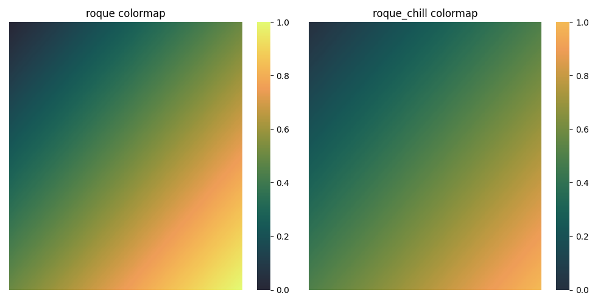
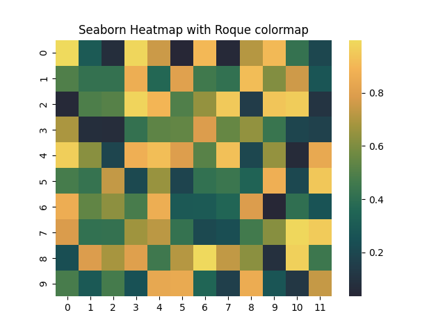
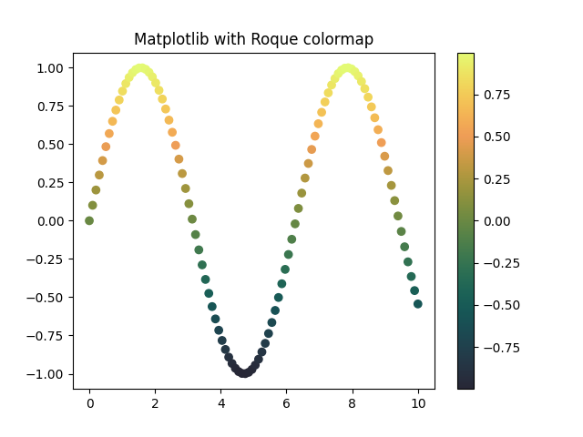

<div align="center">

# Roque Color Map



</div>

<div align="center">

  

</div>


## Table of Contents

- [About](#about)
- [Getting Started](#getting_started)
  - [Installing with uv](#installing_with_uv)
  - [Installing with pip](#installing_with_pip)
  - [Installing with Poetry](#installing_with_poetry)
  - [Installing from source for development (with uv)](#installing_from_source_with_uv)
- [Usage](#usage)
- [Testing](#testing)
- [Contributing](#contributing)

## About <a name = "about"></a>

`roque-cmap` is a Python package that provides custom color maps for use in data visualization. It includes functions to generate evenly spaced arrays of colors and to create `matplotlib` colormaps from these custom colors.

The package includes two palettes: `roque` and `roque_chill`. Both colormaps are inspired by the classic `viridis` palette, and are *perceptually uniform*, meaning they are particularly suited to representing numeric values. The `roque_chill` colormap is a modified version of the `roque` with some of the darkest and brightest colors removed for a more subdued look.

## Getting Started <a name = "getting_started"></a>

These instructions will get you a copy of the project up and running on your local machine for development and testing purposes. See deployment for notes on how to deploy the project on a live system.

### Prerequisites

- Recommended: Python 3.11 or higher (may also work with lower versions)
- `matplotlib` for using the built-in colormap

### Installing with uv <a name = "installing_with_uv"></a>

If you prefer using [uv](https://docs.astral.sh/uv/) for environment and dependency management, you can install `roque-cmap` straight from GitHub (the project is not on PyPI):

```sh
# add the package to an existing uv-managed project
uv add git+https://github.com/astrojarred/roque-cmap.git
```

Or spin up a fresh virtual environment and install directly from the repo URL:

```sh
uv init
uv add git+https://github.com/astrojarred/roque-cmap.git
```

### Installing with pip <a name = "installing_with_pip"></a>

```sh
# install locally after cloning
git clone https://github.com/astrojarred/roque-cmap
pip install ./roque-cmap
```

### Installing with Poetry <a name = "installing_with_poetry"></a>

Add the following line to your pyproject.toml file:

```toml
[tool.poetry.dependencies]
roque-cmap = { git = "https://github.com/astrojarred/roque-cmap.git" }
```

Then run:

```sh
poetry install
```

### Installing from source for development (with uv) <a name = "installing_from_source_with_uv"></a>

1. Clone the repository:

   ```sh
   git clone https://github.com/astrojarred/roque-cmap
   cd roque-cmap
   ```

2. Install the development dependencies:

   ```sh
   uv sync --group dev
   ```

3. Install the package in editable mode:

   ```sh
   uv pip install -e .
   ```

## Usage <a name = "usage"></a>

Add notes about how to use the system.

### Examples

<p align="center">
  <div style="display: inline-block; text-align: center; width: 30%;">
    <h4>Example 1</h4>
    
  </div>
  <div style="display: inline-block; text-align: center; width: 30%;">
    <h4>Example 2</h4>
    
  </div>
  <div style="display: inline-block; text-align: center; width: 30%;">
    <h4>Example 3</h4>
    
  </div>
</p>

Here is an example of how to use the `roque` and `roque_chill` functions:

```python
import matplotlib.pyplot as plt
import seaborn as sns
from roque_cmap import roque, roque_chill
import numpy as np

# Example 1
# Create a heatmap with the custom colormap in seaborn
data = np.random.rand(10, 12)
sns.heatmap(data, cmap=roque(10))  # sample 10 colors from the colormap
plt.title("Seaborn Heatmap with Roque colormap")
plt.show()

# Example 2
# Show off all colors
size = 255
data = np.zeros((size, size))
for i in range(size):
    for j in range(size):
        data[i, j] = (i + j) / (2 * size - 2)

sns.heatmap(data, cmap=roque())
# hide the ticks and labels
plt.xticks([])
plt.yticks([])
plt.title("Roque colormap")
plt.show()

# Example 3
# Create a matplotlib plot with the custom colormap
x = np.linspace(0, 10, 100)
y = np.sin(x)
plt.scatter(x, y, c=y, cmap=roque())
plt.colorbar()
plt.title("Matplotlib with Roque colormap")
plt.show()

# Example 4
# Compare roque and chill-roque side by side
size = 200
data = np.zeros((size, size))
for i in range(size):
   for j in range(size):
      data[i, j] = (i + j) / (2 * size - 2)

fig, axs = plt.subplots(1, 2, figsize=(10, 5))
for a, m in enumerate([roque, roque_chill]):
   sns.heatmap(data, cmap=m(), ax=axs[a])
   axs[a].set_title(f"{m().name} colormap")
   axs[a].set_xticks([])
   axs[a].set_yticks([])

plt.tight_layout()
plt.show()

```

## Testing <a name = "testing"></a>

The project uses `pytest` for testing. To run the test suite:

```sh
uv run pytest
```

To run tests with verbose output:

```sh
uv run pytest -v
```

To check test coverage:

```sh
uv run pytest --cov=roque_cmap --cov-report=term-missing
```

This will show which lines of code are covered by tests and which are missing.

## Contributing <a name = "contributing"></a>

1. Clone the repository or your fork:

   ```sh
   git clone https://github.com/astrojarred/roque-cmap.git
   cd roque-cmap
   ```

2. Install the development dependencies:

   ```sh
   uv sync --group dev
   ```

3. Install the package in editable mode:

   ```sh
   uv pip install -e .
   ```

4. Run the tests to ensure everything is set up correctly:

   ```sh
   uv run pytest
   ```
