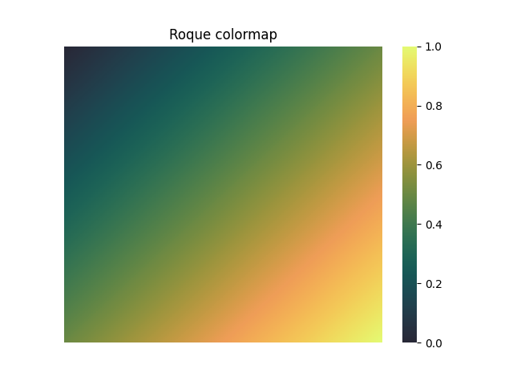

# Roque Color Map



## Table of Contents

- [About](#about)
- [Getting Started](#getting_started)
- [Usage](#usage)
- [Contributing](#contributing)

## About <a name = "about"></a>

`roque-cmap` is a Python package that provides custom color maps for use in data visualization. It includes functions to generate evenly spaced arrays of colors and to create matplotlib colormaps from these custom colors.

## Getting Started <a name = "getting_started"></a>

These instructions will get you a copy of the project up and running on your local machine for development and testing purposes. See deployment for notes on how to deploy the project on a live system.

### Prerequisites

- Python 3.8 or higher
- `matplotlib` for using the built-in colormap

### Installing with pip

```sh
# install locally after cloning
git clone https://github.com/astrojarred/roque-cmap
pip install ./roque-cmap
```

### Installing with Poetry

Add the following line to you pyproject.toml file:

```toml
[tool.poetry.dependencies]
roque-cmap = { git = "" }
```

Then run:

```sh
poetry install
```

### Installing from source (with poetry)

1. Clone the repository:

   ```sh
   git clone https://github.com/astrojarred/roque-cmap
   cd roque-cmap
   ```

2. Install the dependencies using Poetry:

   ```sh
   poetry install
   ```

3. Activate the virtual environment:
   ```sh
   poetry shell
   ```

## Usage <a name = "usage"></a>

Add notes about how to use the system.

### Examples

<p align="center">
  <div style="display: inline-block; text-align: center; width: 30%;">
    <h4>Example 1</h4>
    
  </div>
  <div style="display: inline-block; text-align: center; width: 30%;">
    <h4>Example 2</h4>
    
  </div>
  <div style="display: inline-block; text-align: center; width: 30%;">
    <h4>Example 3</h4>
    
  </div>
</p>

Here is an example of how to use the `roque` and `cmap` functions:

```python
import matplotlib.pyplot as plt
import seaborn as sns
from roque_cmap import cmap
import numpy as np

# Example 1
# Create a heatmap with the custom colormap in seaborn
data = np.random.rand(10, 12)
sns.heatmap(data, cmap=cmap(10))  # sample 10 colors from the colormap
plt.title("Seaborn Heatmap with Roque colormap")
plt.show()

# Example 2
# Show off all colors
size = 255
data = np.zeros((size, size))
for i in range(size):
    for j in range(size):
        data[i, j] = (i + j) / (2 * size - 2)

sns.heatmap(data, cmap=cmap())
# hide the ticks and labels
plt.xticks([])
plt.yticks([])
plt.title("Roque colormap")
plt.show()

# Example 3
# Create a matplotlib plot with the custom colormap
x = np.linspace(0, 10, 100)
y = np.sin(x)
plt.scatter(x, y, c=y, cmap=cmap())
plt.colorbar()
plt.title("Matplotlib with Roque colormap")
plt.show()
```

## Contributing <a name = "contributing"></a>

Install [Poetry](https://python-poetry.org/docs/)

1. Clone the repository or your fork:

   ```sh
   git clone https://github.com/yourusername/roque-cmap.git
   cd roque-cmap
   ```

2. Install the dependencies and dev dependencies using Poetry:

   ```sh
   poetry install --with dev
   ```

3. Activate the virtual environment:

   ```sh
   poetry shell
   ```

4. Run the tests to ensure everything is set up correctly:

   ```sh
   pytest
   ```
